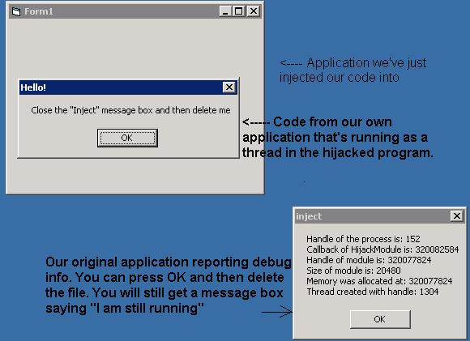



## Delete a file in use \- Run an EXE in another process' memory \- EXE Hijacking

### Description

Updated 4/23/2003- Deletes itself from disk and unloads from memory, and then creates a new form from SCRATCH in the remote process, which shows up perfectly. Also shows how to send data to the remote process.

Descritpion: Hey everyone, I've spent over 5 days non-stop coding this piece of code. Basically, it allows you to run your EXE in the memory space of a running process. You could for example run test.exe in the memory of explorer.exe, and then include a module called "DeleteOriginal", which will be run as a thread inside explorer.exe. You could make it delete your original exe, as well as perform any additional tasks. This is called "Process Hijacking" and is an extremly advanced technique, performed till now only in C++ or ASM/Delphi. The original ASM/Delphi code is included, with credits to Aphex. Please please PLEASE do read the comments in the main bas file, they will explain how to get the code to compile properly. The problem for now is that it can only inject code into VB6 executables (you will need to compile a blank project). I am requesting PSC's help on this. Nevertheless, everything till that point works perfectly, and might help some of you. Everything is fully commented, and once again, please read the comments in the bas, they will explain how to get the app to compile.
 
### More Info
 

             |
---                |---
**Submitted On**   |2003-04-21 08:18:02
**By**             |[Ion Alex Ionescu](https://github.com/Planet-Source-Code/PSCIndex/blob/master/ByAuthor/ion-alex-ionescu.md)
**Level**          |Advanced
**User Rating**    |4.8 (179 globes from 37 users)
**Compatibility**  |VB 4\.0 \(32\-bit\), VB 5\.0, VB 6\.0
**Category**       |[Windows API Call/ Explanation](https://github.com/Planet-Source-Code/PSCIndex/blob/master/ByCategory/windows-api-call-explanation__1-39.md)
**World**          |[Visual Basic](https://github.com/Planet-Source-Code/PSCIndex/blob/master/ByWorld/visual-basic.md)
**Archive File**   |[Delete\_a\_f1579914272003\.zip](https://github.com/Planet-Source-Code/ion-alex-ionescu-delete-a-file-in-use-run-an-exe-in-another-process-memory-exe-hijacking__1-44907/archive/master.zip)

